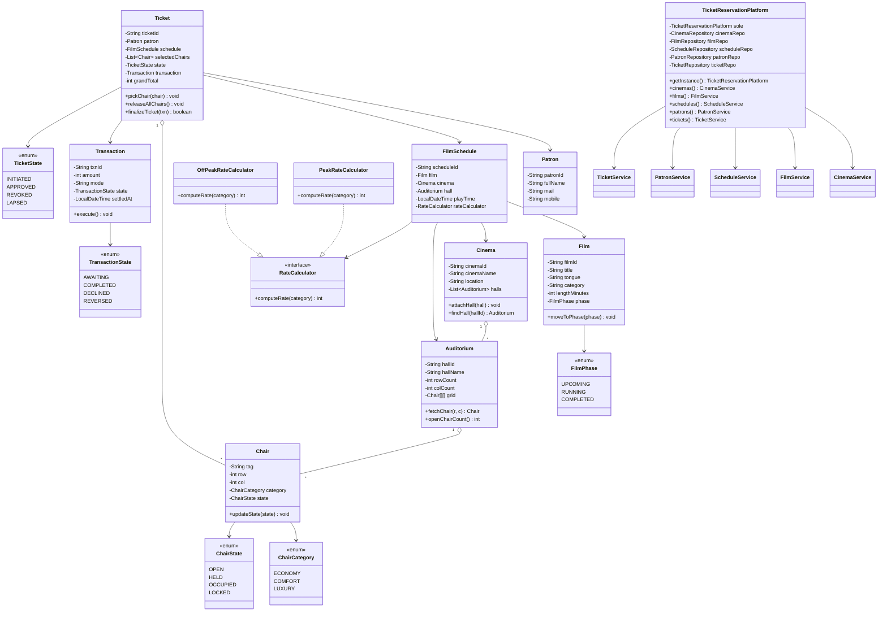
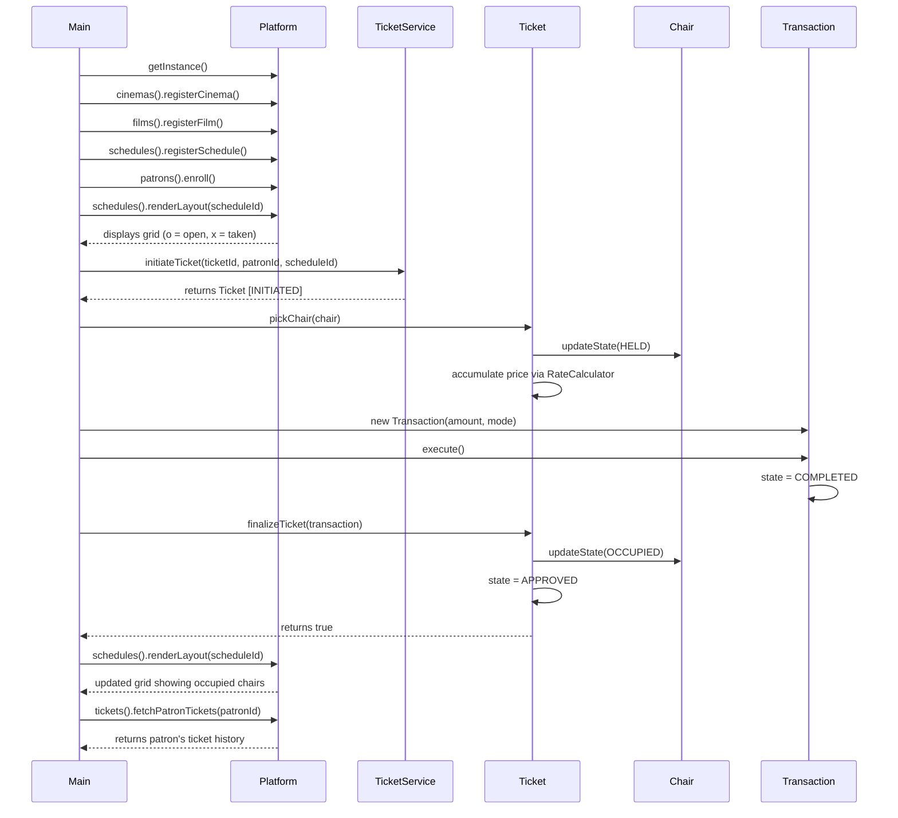

# Ticket Reservation Platform — Low Level Design

A complete low-level design implementation of a movie ticket reservation platform modeled after BookMyShow. The system handles cinema management, auditorium setup, film cataloging, schedule creation, seat selection, ticket booking, transaction processing, and dynamic pricing through a cleanly layered Java architecture.

## Table of Contents

- [Overview](#overview)
- [Architecture](#architecture)
- [Project Structure](#project-structure)
- [Design Patterns](#design-patterns)
- [SOLID Principles](#solid-principles)
- [Core Entities](#core-entities)
- [Enumerations](#enumerations)
- [Strategy Layer](#strategy-layer)
- [Repository Layer](#repository-layer)
- [Service Layer](#service-layer)
- [Controller Layer](#controller-layer)
- [Reservation Flow](#reservation-flow)
- [UML Class Diagram](#uml-class-diagram)
- [Sequence Diagram](#sequence-diagram)
- [How to Run](#how-to-run)
- [Demo Coverage](#demo-coverage)
- [Current Limitations](#current-limitations)
- [Possible Enhancements](#possible-enhancements)

## Overview

This project demonstrates how a ticket-booking platform can be structured using object-oriented design principles, layered architecture, and standard design patterns. The implementation focuses on:

- Modeling domain entities with clear boundaries and responsibilities
- Separating data access, business logic, and orchestration into distinct layers
- Providing extensibility through abstractions and interfaces
- Simulating an end-to-end ticket reservation workflow from setup to transaction confirmation

The platform supports multiple cinemas across different cities, multiple auditoriums per cinema, grid-based seating with categorized pricing, dynamic rate calculation through interchangeable strategies, and a complete ticket lifecycle from initiation through finalization.

## Architecture

The system follows a **layered architecture** with four distinct tiers:

```
┌─────────────────────────────────────────┐
│              Main (Entry Point)         │
├─────────────────────────────────────────┤
│         Controller (Singleton)          │
│      TicketReservationPlatform          │
├─────────────────────────────────────────┤
│            Service Layer                │
│  CinemaService  │  FilmService          │
│  ScheduleService │ PatronService        │
│  TicketService                          │
├─────────────────────────────────────────┤
│           Repository Layer              │
│  CinemaRepository  │ FilmRepository     │
│  ScheduleRepository│ PatronRepository   │
│  TicketRepository                       │
├─────────────────────────────────────────┤
│             Model Layer                 │
│  Cinema │ Auditorium │ Chair │ Film     │
│  FilmSchedule │ Patron │ Ticket        │
│  Transaction                            │
├─────────────────────────────────────────┤
│    Enums & Strategy (Cross-Cutting)     │
│  ChairCategory │ ChairState │ FilmPhase │
│  TicketState │ TransactionState         │
│  RateCalculator │ OffPeak │ Peak        │
└─────────────────────────────────────────┘
```

**Data flows downward**: the controller delegates to services, services interact with repositories, and repositories manage model instances. Strategy objects are injected into domain models at creation time.

## Project Structure

```
book-my-show/
├── README.md
└── src/
    ├── Main.java
    ├── enums/
    │   ├── ChairCategory.java
    │   ├── ChairState.java
    │   ├── FilmPhase.java
    │   ├── TicketState.java
    │   └── TransactionState.java
    ├── model/
    │   ├── Auditorium.java
    │   ├── Chair.java
    │   ├── Cinema.java
    │   ├── Film.java
    │   ├── FilmSchedule.java
    │   ├── Patron.java
    │   ├── Ticket.java
    │   └── Transaction.java
    ├── strategy/
    │   ├── RateCalculator.java
    │   ├── OffPeakRateCalculator.java
    │   └── PeakRateCalculator.java
    ├── repository/
    │   ├── CinemaRepository.java
    │   ├── FilmRepository.java
    │   ├── ScheduleRepository.java
    │   ├── PatronRepository.java
    │   └── TicketRepository.java
    ├── service/
    │   ├── CinemaService.java
    │   ├── FilmService.java
    │   ├── ScheduleService.java
    │   ├── PatronService.java
    │   └── TicketService.java
    └── controller/
        └── TicketReservationPlatform.java
```

## Design Patterns

### 1. Singleton Pattern

`TicketReservationPlatform` serves as the single entry point to the entire system. It initializes all repositories and services exactly once and provides access to them through dedicated accessor methods.

```java
TicketReservationPlatform platform = TicketReservationPlatform.getInstance();
platform.cinemas().registerCinema(cinema);
platform.tickets().initiateTicket("TK1", "P1", "FS1");
```

Unlike a monolithic singleton that contains all business logic, this implementation delegates responsibilities to specialized service classes, keeping the singleton thin and focused on wiring.

### 2. Strategy Pattern

`RateCalculator` is an interface that decouples ticket pricing logic from the booking workflow. Different pricing strategies can be attached to different film schedules without modifying any existing code.

| Strategy | Behavior |
|---|---|
| `OffPeakRateCalculator` | Applies a 15% discount on the base chair rate |
| `PeakRateCalculator` | Applies a 25% premium on the base chair rate |

New strategies (matinee pricing, holiday surcharges, student discounts) can be added by simply implementing `RateCalculator`.

### 3. Repository Pattern

Each entity type has a dedicated repository that encapsulates in-memory storage and retrieval. This isolates data access from business logic and makes it straightforward to swap the in-memory store for a database-backed implementation in the future.

```
CinemaRepository    → stores Cinema instances
FilmRepository      → stores Film instances
ScheduleRepository  → stores FilmSchedule instances
PatronRepository    → stores Patron instances
TicketRepository    → stores Ticket instances
```

## SOLID Principles

### Single Responsibility Principle

Every class has one focused role:

| Class | Responsibility |
|---|---|
| `Cinema` | Represents a cinema venue and manages its auditoriums |
| `Auditorium` | Manages the physical seat grid layout |
| `Ticket` | Handles chair selection, price accumulation, and finalization |
| `Transaction` | Manages payment state and execution |
| `ScheduleService` | Orchestrates schedule queries and layout rendering |

### Open/Closed Principle

The pricing mechanism is open for extension and closed for modification. Adding a new pricing model requires only a new `RateCalculator` implementation — no existing classes need to change.

### Liskov Substitution Principle

Any `RateCalculator` implementation (`OffPeakRateCalculator`, `PeakRateCalculator`, or any future implementation) can be used interchangeably wherever a `RateCalculator` is expected. The `FilmSchedule` and `Ticket` classes are oblivious to which concrete strategy is active.

### Interface Segregation Principle

The `RateCalculator` interface exposes a single method `computeRate(ChairCategory)`. Implementations are not forced to depend on methods they do not use.

### Dependency Inversion Principle

- `FilmSchedule` depends on the `RateCalculator` abstraction, not on `OffPeakRateCalculator` or `PeakRateCalculator` directly
- `TicketService` depends on `PatronRepository` and `ScheduleRepository` abstractions injected through its constructor
- `TicketReservationPlatform` wires dependencies at construction time, keeping high-level modules decoupled from storage details

## Core Entities

### Cinema

Represents a movie venue at a specific location. A cinema contains one or more auditoriums.

| Field | Type | Description |
|---|---|---|
| `cinemaId` | `String` | Unique identifier |
| `cinemaName` | `String` | Display name of the venue |
| `location` | `String` | City and area descriptor |
| `halls` | `List<Auditorium>` | Auditoriums within this cinema |

### Auditorium

Represents a screening hall within a cinema. Initializes a two-dimensional chair grid on construction with automatic category assignment based on row position.

| Field | Type | Description |
|---|---|---|
| `hallId` | `String` | Unique identifier |
| `hallName` | `String` | Display name (e.g., "Dolby Atmos") |
| `rowCount` | `int` | Number of rows |
| `colCount` | `int` | Number of columns |
| `grid` | `Chair[][]` | 2D array of chairs |

**Category Assignment Logic:**
- Top rows (first half) → `ECONOMY`
- Middle rows (second half minus last two) → `COMFORT`
- Bottom two rows → `LUXURY`

### Chair

Represents an individual seat in an auditorium.

| Field | Type | Description |
|---|---|---|
| `tag` | `String` | Identifier like "A1", "B5" |
| `row` | `int` | Row index (zero-based) |
| `col` | `int` | Column index (zero-based) |
| `category` | `ChairCategory` | ECONOMY, COMFORT, or LUXURY |
| `state` | `ChairState` | OPEN, HELD, OCCUPIED, or LOCKED |

### Film

Represents a movie with its metadata and lifecycle phase.

| Field | Type | Description |
|---|---|---|
| `filmId` | `String` | Unique identifier |
| `title` | `String` | Movie title |
| `tongue` | `String` | Language |
| `category` | `String` | Genre |
| `lengthMinutes` | `int` | Duration in minutes |
| `phase` | `FilmPhase` | UPCOMING, RUNNING, or COMPLETED |

### FilmSchedule

Represents a specific screening — the binding of a film to a cinema, auditorium, time slot, and pricing strategy.

| Field | Type | Description |
|---|---|---|
| `scheduleId` | `String` | Unique identifier |
| `film` | `Film` | The movie being screened |
| `cinema` | `Cinema` | The venue |
| `hall` | `Auditorium` | The specific hall |
| `playTime` | `LocalDateTime` | Scheduled start time |
| `rateCalculator` | `RateCalculator` | Pricing strategy for this screening |

### Patron

Represents a registered user of the platform.

| Field | Type | Description |
|---|---|---|
| `patronId` | `String` | Unique identifier |
| `fullName` | `String` | Display name |
| `mail` | `String` | Email address |
| `mobile` | `String` | Phone number |

### Ticket

Captures the reservation transaction. Manages chair selection, price accumulation via the schedule's rate calculator, and finalization against a successful transaction.

| Field | Type | Description |
|---|---|---|
| `ticketId` | `String` | Unique identifier |
| `patron` | `Patron` | The customer |
| `schedule` | `FilmSchedule` | The target screening |
| `selectedChairs` | `List<Chair>` | Chairs picked by the patron |
| `state` | `TicketState` | INITIATED, APPROVED, REVOKED, or LAPSED |
| `transaction` | `Transaction` | Associated payment (set on finalization) |
| `grandTotal` | `int` | Accumulated price |

**Chair lifecycle within a ticket:**
1. `pickChair()` — validates the chair is `OPEN`, adds it, marks it `HELD`, accumulates price
2. `releaseAllChairs()` — marks all selected chairs back to `OPEN`, clears list, resets total
3. `finalizeTicket(txn)` — if transaction is `COMPLETED`, marks all chairs `OCCUPIED` and ticket `APPROVED`

### Transaction

Represents a payment attempt with its lifecycle.

| Field | Type | Description |
|---|---|---|
| `txnId` | `String` | Unique identifier |
| `amount` | `int` | Payment amount |
| `mode` | `String` | Payment method (NET_BANKING, DEBIT_CARD, etc.) |
| `state` | `TransactionState` | AWAITING, COMPLETED, DECLINED, or REVERSED |
| `settledAt` | `LocalDateTime` | Timestamp of completion |

## Enumerations

### ChairCategory
Defines seat tiers with base pricing:

| Value | Base Rate (₹) |
|---|---|
| `ECONOMY` | 120 |
| `COMFORT` | 200 |
| `LUXURY` | 350 |

### ChairState
Tracks seat availability:

| Value | Meaning |
|---|---|
| `OPEN` | Available for selection |
| `HELD` | Temporarily reserved during booking |
| `OCCUPIED` | Confirmed and booked |
| `LOCKED` | Administratively blocked |

### FilmPhase
Tracks movie lifecycle:

| Value | Meaning |
|---|---|
| `UPCOMING` | Announced but not yet screening |
| `RUNNING` | Currently in theaters |
| `COMPLETED` | No longer screening |

### TicketState
Tracks booking lifecycle:

| Value | Meaning |
|---|---|
| `INITIATED` | Ticket created, pending chair selection and payment |
| `APPROVED` | Payment successful, ticket confirmed |
| `REVOKED` | Ticket cancelled |
| `LAPSED` | Ticket expired |

### TransactionState
Tracks payment lifecycle:

| Value | Meaning |
|---|---|
| `AWAITING` | Payment initiated, not yet processed |
| `COMPLETED` | Payment successful |
| `DECLINED` | Payment failed |
| `REVERSED` | Payment refunded |

## Strategy Layer

The strategy layer implements the **Strategy Pattern** for dynamic pricing:

```
              ┌──────────────────┐
              │  RateCalculator  │ (interface)
              │  computeRate()   │
              └────────┬─────────┘
                       │
           ┌───────────┴───────────┐
           │                       │
┌──────────┴────────┐  ┌──────────┴────────┐
│OffPeakRateCalc    │  │ PeakRateCalc      │
│ rate × 0.85       │  │ rate × 1.25       │
└───────────────────┘  └───────────────────┘
```

**Example price calculation for a COMFORT chair (base ₹200):**
- Off-Peak: `200 × 0.85 = ₹170`
- Peak: `200 × 1.25 = ₹250`

## Repository Layer

Each repository provides a consistent in-memory CRUD interface:

| Repository | Entity | Key |
|---|---|---|
| `CinemaRepository` | `Cinema` | `cinemaId` |
| `FilmRepository` | `Film` | `filmId` |
| `ScheduleRepository` | `FilmSchedule` | `scheduleId` |
| `PatronRepository` | `Patron` | `patronId` |
| `TicketRepository` | `Ticket` | `ticketId` |

All repositories expose `save()`, `findById()`, and `findAll()` operations backed by `HashMap` storage.

## Service Layer

Services encapsulate business logic and query operations on top of repositories:

| Service | Key Operations |
|---|---|
| `CinemaService` | `registerCinema()`, `fetchCinema()`, `fetchByLocation()` |
| `FilmService` | `registerFilm()`, `fetchFilm()`, `fetchRunningFilms()` |
| `ScheduleService` | `registerSchedule()`, `fetchSchedule()`, `fetchByCinema()`, `fetchByFilm()`, `countOpenChairs()`, `renderLayout()` |
| `PatronService` | `enroll()`, `fetchPatron()` |
| `TicketService` | `initiateTicket()`, `fetchTicket()`, `fetchPatronTickets()` |

## Controller Layer

`TicketReservationPlatform` is the singleton controller that:

1. Instantiates all five repositories
2. Instantiates all five services with their required dependencies
3. Exposes service accessors: `cinemas()`, `films()`, `schedules()`, `patrons()`, `tickets()`

This keeps the controller thin — it wires dependencies but contains no business logic itself.

## Reservation Flow

The system follows this end-to-end process:

```
1. Setup
   ├── Register cinemas with auditoriums
   ├── Register films and set their phase
   ├── Create film schedules (film + cinema + hall + time + pricing)
   └── Enroll patrons

2. Reservation
   ├── Patron selects a film schedule
   ├── Platform displays auditorium layout (open/taken chairs)
   ├── Patron picks specific chairs
   │   └── Each chair: OPEN → HELD, price accumulated via RateCalculator
   ├── Transaction created with grand total
   ├── Transaction executed (simulated)
   │   └── State: AWAITING → COMPLETED
   └── Ticket finalized against successful transaction
       ├── Each chair: HELD → OCCUPIED
       └── Ticket state: INITIATED → APPROVED

3. Queries
   ├── Fetch cinemas by location
   ├── Fetch currently running films
   ├── View auditorium layout for any schedule
   ├── Count open chairs for a schedule
   └── View patron ticket history
```

## UML Class Diagram



## Sequence Diagram



## How to Run

Navigate to the source directory and compile all Java files:

```bash
cd book-my-show/src
javac -d out enums/*.java strategy/*.java model/*.java repository/*.java service/*.java controller/*.java Main.java
java -cp out Main
```

On Windows PowerShell, use backslashes:

```powershell
cd book-my-show\src
javac -d out enums\*.java strategy\*.java model\*.java repository\*.java service\*.java controller\*.java Main.java
java -cp out Main
```

## Demo Coverage

The console demo in `Main.java` exercises:

- Cinema registration across multiple cities (Delhi NCR, Pune, Hyderabad)
- Auditorium creation with different configurations (5×8, 7×10, 6×9)
- Film cataloging with phase management
- Schedule creation with off-peak and peak pricing strategies
- Patron enrollment
- Location-based cinema search
- Running films query
- Visual seat layout rendering
- Complete ticket reservation with chair selection
- Price calculation using off-peak strategy (15% discount)
- Second reservation using peak strategy (25% premium)
- Transaction processing via different payment modes (NET_BANKING, DEBIT_CARD)
- Ticket finalization with chair state transitions
- Updated layout display showing occupied chairs
- Patron ticket history lookup
- Open chair count query

## Current Limitations

This is a clean LLD implementation, and the following production concerns are intentionally simplified:

- No concurrency handling for simultaneous chair selection
- No persistence or database integration (in-memory only)
- No authentication or authorization mechanism
- No real payment gateway integration (transaction execution is simulated)
- No ticket cancellation or refund workflow
- No seat lock timeout mechanism
- No search, filtering, or recommendation engine
- No exception hierarchy beyond basic validation

## Possible Enhancements

- Implement ticket cancellation with automatic transaction reversal
- Add temporary chair hold with configurable timeout expiry
- Support location-based film schedule discovery and filtering
- Implement coupon codes and promotional rate calculators
- Add occupancy-driven dynamic pricing (higher prices as chairs fill up)
- Introduce a notification service for confirmations and reminders
- Persist data to a relational database via the repository layer
- Expose REST APIs on top of the service layer
- Add concurrent access controls with synchronized chair locking
- Support multiple language and currency configurations
